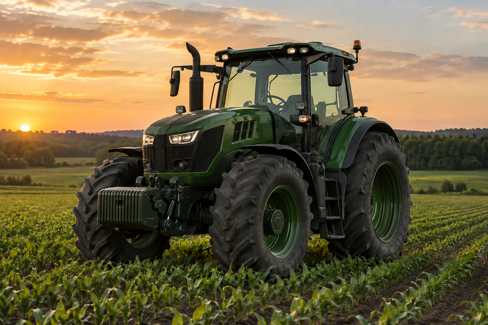

  

  # AgroSense

  **Inteligência que antecipa falhas no campo.**

  Landing page do projeto AgroSense · **Primeira entrega acadêmica**

---

## O projeto

A AgroSense apresenta uma proposta de monitoramento de máquinas agroindustriais. A ideia é usar leituras dos equipamentos para identificar comportamentos fora do padrão e apoiar o planejamento da manutenção.

Esta versão é **uma landing page de apresentação**. Ela mostra o problema, a solução proposta, um exemplo visual de painel, as tecnologias descritas no projeto e a equipe. Os números exibidos são **fictícios**; a página ainda não recebe dados de sensores nem executa análises em tempo real.

## Primeira entrega

| Já está na página | Em desenvolvimento |
| --- | --- |
| Apresentação do problema e da solução | Integração com dados reais dos equipamentos |
| Fluxo explicativo de coleta e análise | Sistema de alertas e análise automatizada |
| Prévia visual do painel com dados ilustrativos | Painel funcional e histórico persistido |
| Seções de tecnologia, público e equipe | Fotos, portfólios e canais oficiais de contato |

> **Estado do projeto:** primeira entrega. A landing page e o sistema AgroSense ainda estão em desenvolvimento.

## Tecnologias desta landing page

- **HTML5** para o conteúdo e a estrutura das páginas.
- **Bootstrap 5** para a grade responsiva e os componentes básicos.
- **CSS** para cores, tipografia e detalhes da identidade visual.

O site é estático e não precisa de instalação, backend ou JavaScript. As tecnologias mencionadas na seção “Por trás da AgroSense” representam o planejamento apresentado pelo projeto; o código deste repositório contém apenas a landing page.

## Abrir no navegador

1. Baixe o repositório ou clone-o.
2. Abra o arquivo `index.html` no navegador.
3. Navegue pelas seções e pelas páginas da equipe.

O Bootstrap está incluído em `css/vendor`, então a página também abre sem conexão com a internet.

## Organização dos arquivos

| Caminho | Conteúdo |
| --- | --- |
| `index.html` | Landing page principal |
| `css/style.css` | Estilos próprios da AgroSense |
| `css/vendor/` | Bootstrap e seu arquivo de licença |
| `img/` | Imagem ilustrativa e ícone do site |
| `gustavo.html`, `louize.html`, `paulo.html`, `samara.html` | Páginas da equipe com portfólios em preparação |

## Equipe

- Gustavo Henrique Da Silva Barbosa Pereira
- Louize Vinciaqui Garcia
- Paulo Ricardo Souza Lima
- Samara Vitória Santos Oliveira

---

  AgroSense · Primeira entrega · 2026

